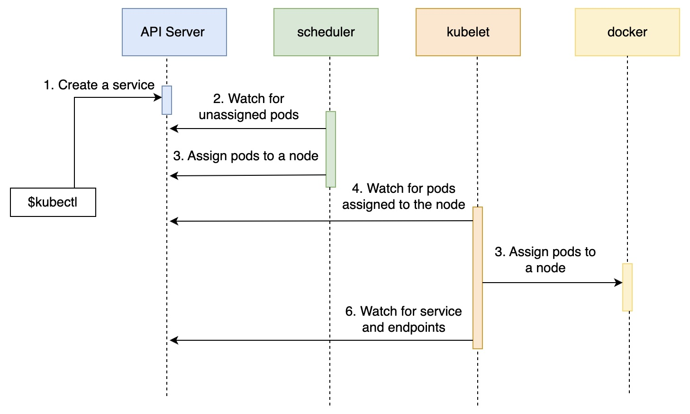

# Devops for all

Common lib with notes and scripts about devops/deployment

## Resources

Most of the content is taken from the Educative.io's DevOps for Engineers skill path

## How does a pod get created?

