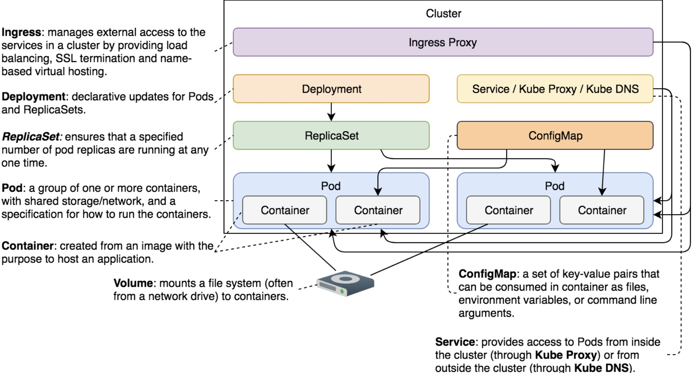

# Notes about ConfigMaps

Contains common notes about config maps.

## Notes

* ConfigMaps allow us to keep configurations separate from application images. Such separation is useful when other alternatives are not a good fit.
* Environment variables fit well into distributed systems. They are easy to define, and they are portable. They are the ideal choice for configuration mechanism of new applications.
* *ConfigMap* allows us to “inject” configuration into containers by taking a configuration from a source and mounting it into running containers as a volume.
* All in all, `--from-file` reads the content of one or more files, and stores it using file names as keys. `--from-env-file`, assumes that content of a file is in key/value format, and stores each as a separate entry.
* To inject configurations, we can use a volume mount to inject a file or an env reference to add env vars using `configMapKeyRef`.
* When working with a large value, we can start with the pipe sign (|)

## Common commands

* Creating a config map (we can do more than one file): `kubectl create cm my-config --from-file=<another optional file>`
* List config maps: `kc get cm`
* Describe config maps: `kubectl describe cm <config name>`
* Creating a config from a set of key values: `kubectl create cm my-config --from-literal=something=else --from-literal=weather=sunny`
* Creating a config map from a set of env var: `kubectl create cm my-config --from-env-file=my-env-file.yml`

## Flow of a Config Map

