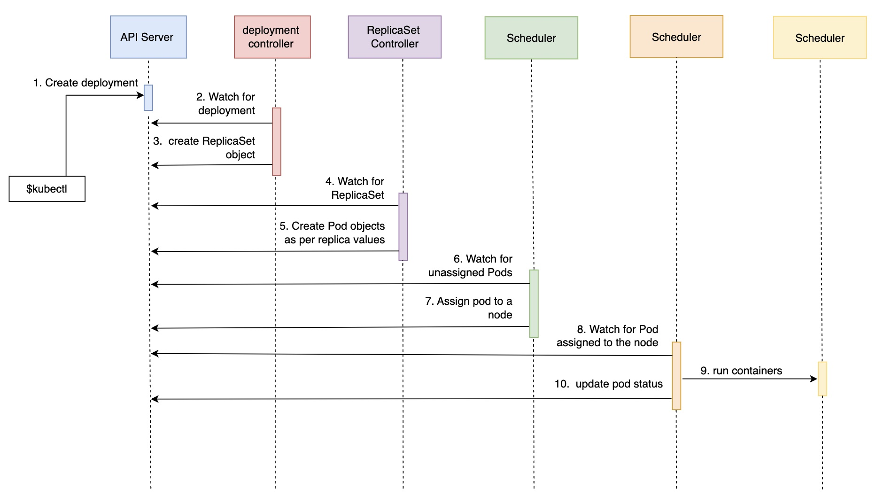

# Notes about Deployments

Contains common notes about deployments.

## Notes

* Kubernetes Deployments provide us with the tools we need to avoid such failures by allowing us to update our applications without downtime.
* Deployments control ReplicaSets. The Deployment created the ReplicaSet which, in turn, created Pods.
* *RevisionHistoryLimit* defines the number of old ReplicaSets we can rollback. We changed it to 5 and, as a result, we will be able to rollback to any of the previous five ReplicaSets.
* There are two different deployment strategies, the *Recreate* and the *RollingUpdate* strategies.
* The *Recreate* will kill all the existing Pods before an update by stopping the existing pod and then put a new one in its place.
* The *RollingUpdate* allows us to deploy new releases without downtime. It creates a new ReplicaSet with zero replicas and, depending on other parameters, increases the replicas of the new one, and decreases those from the old one.
* Rolling back a release that introduced database changes is often not possible. Even when it is, rolling forward is usually a better option when practicing continuous deployment with high-frequency releases limited to a small scope of changes.
* The number of replicas should not be part of the design. Instead, they are a fluctuating number that changes continuously (or at least often), depending on the traffic, memory and CPU utilization, and so on.

## Common commands

* Check the current progress of the rollout: `kubectl rollout status -w -f <deployment yml file>`
* Undo a rollout: `kubectl rollout undo -f <deployment yml file>`
* Check the rollout history: `kubectl rollout history -f <deployment yml file>`
* Rollout back to a specific revision: `kubectl rollout undo -f <deployment yml file> --to-revision=2`
* Check if the previous command was correct (1 is error): `echo $?`
* Gets all deployment and show labels: `kubectl get deployments --show-labels`
* Update deployment directly using a command and by selecting a set of labels: `kubectl set image deployments -l type=db,vendor=MongoLabs db=mongo:3.4`
* Scale a deployment directly: `kubectl scale deployment <deployment name> --replicas 8`

## Flow of a Deployment

