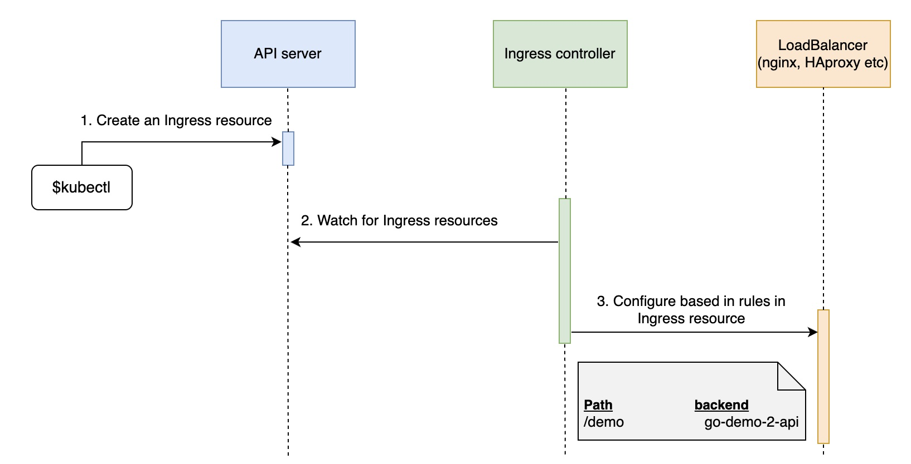
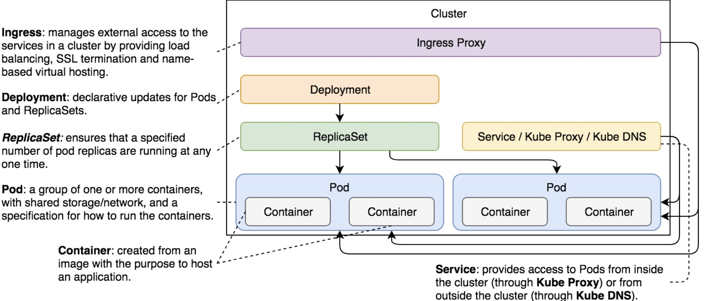

# Notes about Ingresses

Contains common notes about ingresses.

## Notes

* Ingress objects manage external access to the applications running inside a Kubernetes cluster.
* Users don't know in which port the service can be accessed from and so, ingresses help out with that.
* Ingresses also help out with the SSL certificates. We should aim to have secure applications.
* Kubernetes does not have a "controller" for the ingresses and instead only has an API that allows the user to install the ingress that his service needs. Like if using AWS, a user would install the AWS's ingress
* The *annotations* section in *metadata* allows us to provide additional information to the Ingress Controller. They also bring a lot of flexibility into the creation of ingress controllers by the community.
* `<annotation name>/ssl-redirect: "false"` tells the Controller that we do NOT want to redirect all HTTP requests to HTTPS.
* Ingress is a (kind of) Service that runs on all nodes of a cluster. A user can send requests to any and, as long as they match one of the rules, they will be forwarded to the appropriate Service.
* When we add a `host: <url>` entry it will only forward request coming from that host.
* When an Ingress `spec` is without rules, it is considered a default backend. As such, it will forward all requests that do not match paths and/or domains set as rules in the other Ingress resources.

## Common commands

* Enabling Ingress on k3d: `kubectl apply -f https://raw.githubusercontent.com/kubernetes/ingress-nginx/controller-v1.3.0/deploy/static/provider/cloud/deploy.yaml`
* Getting ingresses in cluster: `kubectl get ing`

## Flow of an Ingress

## Ingress in a Cluster

