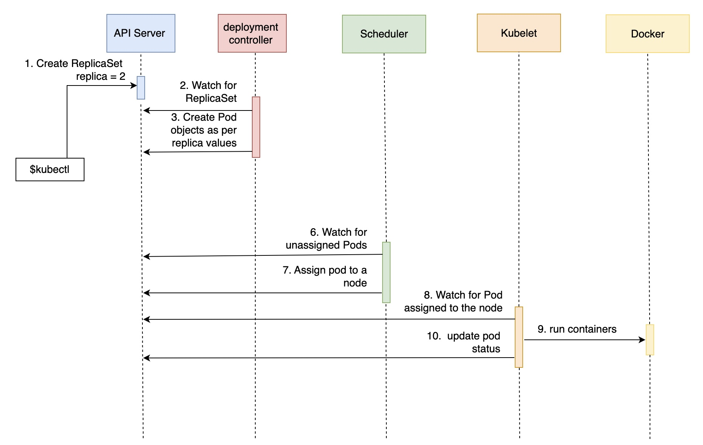
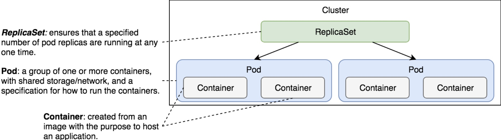

# Notes about ReplicaSets

Contains common notes about replica sets.

## Notes

* Most applications should be scalable and all must be fault tolerant. Pods do not provide those features, ReplicaSets do.
* If a Pod is destroyed, Kubernetes will do nothing to remedy the problem. That is if Pods are created without Controllers.
* ReplicaSets are Controllers that ensure that a specified number of replicas of a pod is always running
* ReplicaSets functions as a self-healing mechanism and they provide fault-tolerance and high availability
* When creating ReplicaSets, the name in the metadata definition, has to match the same name of the pod
* The `--save-config` argument, used when creating a RS, can be use to do some additional operations later on. Or, we can instead use the `apply` command which is a `create` with the mentioned flag. We might want to save the configuration to, for example, scale the number of pods

## Common commands

* List replica sets: `kc get rs`
* Delete replica set *without* removing pods: `kubectl delete -f <my replica set> --cascade=orphan`
* Delete replica set *plus* removing pods: `kubectl delete -f <my replica set>`

## Flow of pod scheduling with a replica set

## Where is the Replica Set

