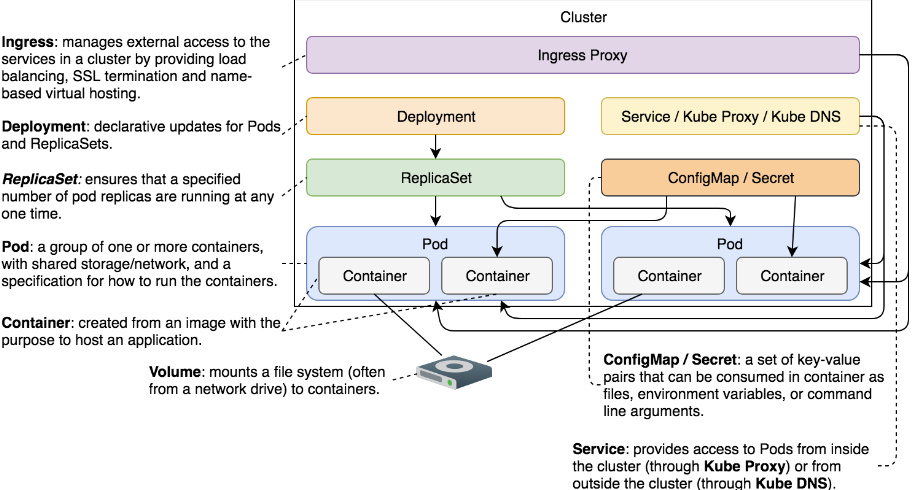

# Notes about Secrets

Contains common notes about secrets.

## Notes

* We cannot treat all information equally. Sensitive data needs to be handled with additional care. Kubernetes provides an additional level of protection through Secrets.
* A Secret is a relatively small amount of sensitive data. Some of the typical candidates for Secrets would be passwords, tokens, and SSH keys.
* Kubernetes automatically modifies the Pods to use the default Secret. Unless we tweak Service Accounts, every Pod we create will have this Secret.
* This default secret is used to configure the kubernetes api directly.
* The major difference from creating config maps is that we can specify the type of secret being created, like `generic` secret which happen to use the same syntax as ConfigMaps.
* There are other secret types like `docker-registry` and `tls`. The former can be used to provide kubelet with credentials it needs to pull images from private registries. The latter is used for storing certificates.
* Just as with ConfigMaps, generic Secrets can use `--from-env-file`, `--from-file`, and `--from-literal` as sources.
* Secrets are encoded in base64
* *defaultMode* is used to give permission. 0444 will give read permission to everyone. Typically, we use 0400
* The only significant difference between ConfigMaps and Secrets is that the latter creates files in a tmpfs (temporary file storage). Secrets are constructed as in-memory files, thus leaving no trace on the host’s files system.
* Almost everything Kubernetes needs is stored in *etcd*. That includes Secrets. The problem is that they are stored as plain text. Anyone with access to etcd has access to Kubernetes Secrets. Also, *etcd* stores data to disk as plain text.
* To secure applications, we can do the following besides using secrets:
  * Secure the communication between etcd instances with SSL/TLS.
  * Limit the access to etcd and wipe the disk or partitions that were used by it.
  * Do not define Secrets in YAML files stored in a repository. Create Secrets through ad-hoc kubectl create commands. If possible, delete commands history afterward.
  * Make sure that the applications using Secrets do not accidentally output them to logs or transmit them to other applications.

## Common commands

* Get secrets in namespace: `kc get secrets`
* Create secrets (almost the same as config-maps): `kubectl create secret generic my-creds --from-literal=username=jdoe --from-literal=password=incognito`

## Flow of a Secret

