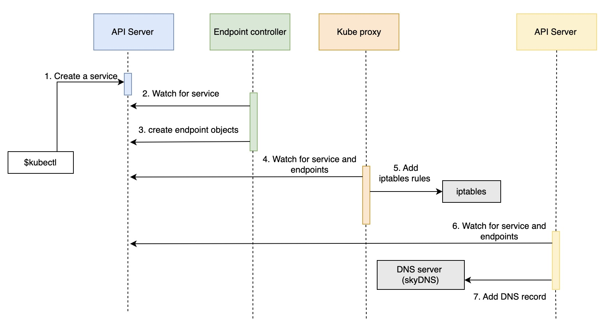
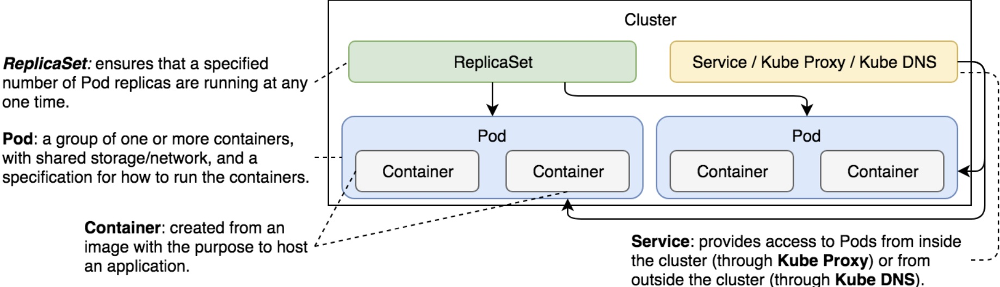

# Notes about Services

Contains common notes about services.

## Notes

* Kubernetes Services provide addresses through which associated Pods can be accessed.
* Services allow pods to communicate with each other.
* *NodePort* exposes a port to the outside world.
* *ClusterIP* (the default type) exposes the port only inside the cluster.
* The *LoadBalancer* type is only useful when combined with cloud provider’s load balancer.
* Endpoint controller is watching the API server for new service events.
* If there is no type in the service declaration yml file, it’ll default to ClusterIP.
* I should create the service and rs in the same file by splitting it with a `---` in between them.
* Kubernetes converts Service names into DNSes and adds them to the DNS server.
* Iptables act as a load balancer and forward requests randomly among Endpoints of the Service.
* KubeProxy handles communication inside the cluster and KubeDNS from outside the cluster.

## Common commands

* Creating a service using a Controller: `kubectl expose rs <name of rs> --name=go-demo-2-svc --target-port=28017 --type=NodePort`
* Port forwarding a node in the cluster: `kubectl port-forward service/<name of the svc> 3000:28017 --address 0.0.0.0`
* List ip configuration: `kubectl get ep <name of the svc> -o yaml`

## Service creation flow

## Service inside cluster

