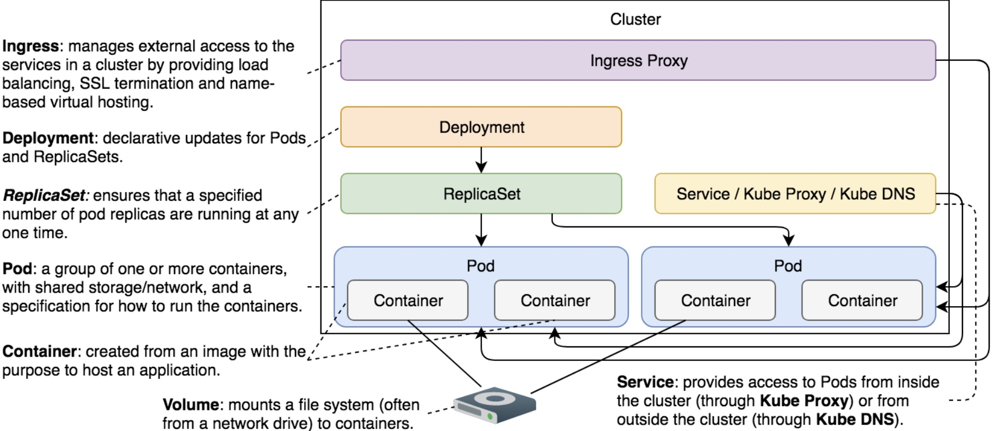

# Notes about Volumes

Contains common notes about volumes.

## Notes

* The problem is that it will create a new container based on the same image. All data accumulated inside a container that crashed will be lost.
* Kubernetes Volumes solve the need to preserve the state across container crashes. In essence, Volumes are references to files and directories made accessible to containers that form a Pod.
* While the primary use-case for Volumes is the preservation of state, there are quite a few others. For example, we might use Volumes to access Docker’s socket running on a host. Or we might use them to access configuration residing in a file on the host file system.
* There are over twenty-five Volume types supported by Kubernetes.
* To build docker images, we should schedule the build process inside our cluster, upload the image somewhere and the deploy it again in our cluster. This makes sure that we have an even distribution of resources and reliability.
* Docker consists of two main pieces. There is a client, and there is a server. By default, the client sends instructions to the server through the socket located in “/var/run/docker.sock”.
* *hostPath* volume type allows us to mount a file or a directory from a host to Pods and, through them, to containers. This one is not fault-tolerant because it mounts it into a *pod*, so if a node dies, it will mount this path in an healthy node, thus losing state. This type supports DirectoryOrCreate, FileOrCreate, Socket, CharDevice and BlockDevice
* An *emptyDir* Volume is created when a Pod is assigned to a node. It will exist for as long as the Pod continues running on that server. What that means is that emptyDir can survive container failures. When a container crashes, a Pod is not removed from the node. Instead, Kubernetes will recreate the failed container inside the same Pod and, thus, preserve the emptyDir Volume. All in all, this Volume type is only partially fault-tolerant.
* The *gitRepo* Volume type will be very significant once we start designing a continuous deployment pipeline.

## Common commands

* Create a pod with the official docker image: `kubectl run docker --image=docker:17.11 --restart=Never docker image ls`
* Port forwarding example: `kc port-forward prometheus-74858d9585-2ldbk --address 0.0.0.0 3000:9000`

## Flow of a Volume

